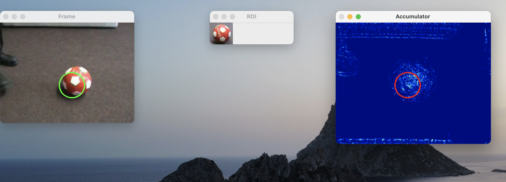

# Object Tracking Project - Vision Class at Sorbonne Université

## Pau Biosca, Kimia Saddredini, and Caterina Leonelli

## Overview
This repository contains the implementation of two object tracking methods for the Vision class at Sorbonne Université. The project is divided into two main parts:
1. **Tracking with the MeanShift Algorithm**
2. **Tracking with the Hough Transform using R-Table**

The code is written in Python and utilizes the OpenCV library for image processing and computer vision tasks.

## Repository Structure
- `Test-Videos/`: Folder containing test video files for the tracking algorithms.
- `Tracking_R_Table.py`: Python script implementing the tracking using the Hough Transform with R-Table method.
- `Tracking_MeanShift.py`: Python script implementing the tracking using the MeanShift algorithm.
- `utils.py`: Utility functions used across the tracking methods.
- `Tracking_TP.pdf`: Project description and specifications provided by the university.

## Tracking with MeanShift Algorithm
The MeanShift tracking algorithm is implemented in `Tracking_MeanShift.py`. This method involves:
- Defining the region of interest (ROI) on the first frame of the video.
- Computing the histogram of the ROI and using it for back projection in subsequent frames.
- Using the MeanShift algorithm to locate the object in each frame.

### Visualizations
*Visualizations of the MeanShift tracking results can be added here.*

## Tracking with Hough Transform using R-Table
The Hough Transform tracking with R-Table is implemented in `Tracking_R_Table.py`. This method includes:
- Conversion of the ROI to grayscale and calculation of its gradient orientation and magnitude.
- Building an R-Table from the gradient information.
- Applying the Hough Transform to detect the object in each frame based on the R-Table.

### Visualizations



## Usage
To run the tracking algorithms, execute the respective Python scripts:
```bash
python Tracking_MeanShift.py
```

```bash
python Tracking_R_Table.py
```

## Dependencies
- Python 3.x
- OpenCV library
- NumPy

## Installation
Ensure you have Python 3.x installed along with the OpenCV and NumPy libraries. You can install the required libraries using pip:
```bash
pip install opencv-python numpy
```

## TODO
- [ ] Understand Mean-Shift algorithm and answer Q1 and Q2 from the project description.
- [ ] Perform the Gradient Visualization for the Hough Transform method and answer Q3 from the project description (It is done in `Tracking_MeanShift.py` but not in `Tracking_R_Table.py`)
- [ ] Think about ways to imporve the tracking results for `Tracking_R_Table.py`.
    - [ ] Look at the thresholding step in the R-Table method.
    - [ ] Compute the R-Table for the ROI found at last frame and use it for the next frame.
    - [ ] Make a simpler accumulator for the Hough Transform that is smaller in size so that the maximum takes into account regions that are close to each other and is not a simple local maxima
- [ ] Do the report for the project.
